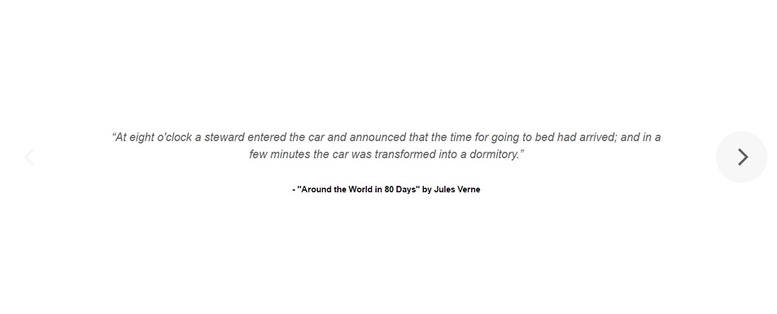

## [Tuts+ - JavaScript For Web Designers / Simple Content Slider](https://webdesign.tutsplus.com/courses/javascript-for-web-designers)

In this tutorial, we learn how to code a simple content slider in JavaScript that can be cycled back and forth using previous and next button.

[View demo site here.](https://webdevtuts.github.io/simple_content_slider/)

